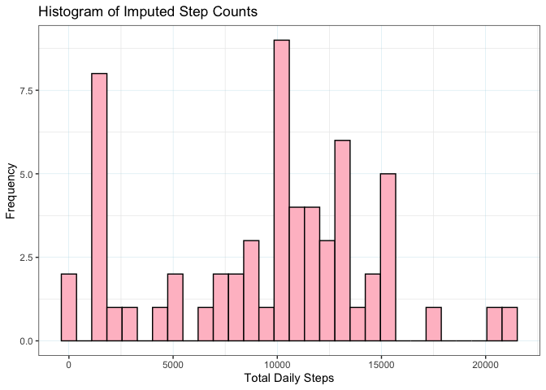

### Loading and preprocessing the data

We'll be making use of `tidyverse` and `lubridate` functions here, so we'll just load both libraries to be safe.


```r
library(tidyverse)
```

```
## ── Attaching packages ─────────────────────────────────────── tidyverse 1.3.0 ──
```

```
## ✓ ggplot2 3.3.2     ✓ purrr   0.3.4
## ✓ tibble  3.0.4     ✓ dplyr   1.0.2
## ✓ tidyr   1.1.2     ✓ stringr 1.4.0
## ✓ readr   1.4.0     ✓ forcats 0.5.0
```

```
## ── Conflicts ────────────────────────────────────────── tidyverse_conflicts() ──
## x dplyr::filter() masks stats::filter()
## x dplyr::lag()    masks stats::lag()
```

```r
library(lubridate)
```

```
## 
## Attaching package: 'lubridate'
```

```
## The following objects are masked from 'package:base':
## 
##     date, intersect, setdiff, union
```

1. Load the data

Let's begin by reading in our data to get a sense for what it looks like:


```r
# `read_csv` will automatically unzip our csv
activity <- read_csv('activity.zip')
```

```
## 
## ── Column specification ────────────────────────────────────────────────────────
## cols(
##   steps = col_double(),
##   date = col_date(format = ""),
##   interval = col_double()
## )
```

```r
# visualize the structure of our data
str(activity)
```

```
## tibble [17,568 × 3] (S3: spec_tbl_df/tbl_df/tbl/data.frame)
##  $ steps   : num [1:17568] NA NA NA NA NA NA NA NA NA NA ...
##  $ date    : Date[1:17568], format: "2012-10-01" "2012-10-01" ...
##  $ interval: num [1:17568] 0 5 10 15 20 25 30 35 40 45 ...
##  - attr(*, "spec")=
##   .. cols(
##   ..   steps = col_double(),
##   ..   date = col_date(format = ""),
##   ..   interval = col_double()
##   .. )
```

Notice, we have the following columns, as described in the instructions:

- **steps**: Number of steps taken in a $5$-minute interval (missing values coded as `NA`).

- **date**: The date on which the measurement was taken in YYYY-MM-DD format.

- **interval**: Identifier for the 5-minute interval in which measurement was taken.

2. Process/transform the data (if necessary) into a format suitable for analysis

The only modification that looks necessary in terms of adjusting the variable *classes* is that the interval should really be converted to a `date-time` object, which we can achieve by taking the results of the integer division (`%/%`) and modulus (`%%`) operators by $100$ to extract the hour and minute that respectively correspond to the interval provided.


```r
# create an `hms` column corresponding to the interval for grouping and time series plotting
activity <- activity %>%
   mutate(intervalFactor = as.factor(activity$interval),
          TimeHMS = hms::as_hms(paste(interval %/% 100, interval %% 100, '00', sep = ':'))
   )

# check to make sure the structure of activity changed accordingly
str(activity)
```

```
## tibble [17,568 × 5] (S3: spec_tbl_df/tbl_df/tbl/data.frame)
##  $ steps         : num [1:17568] NA NA NA NA NA NA NA NA NA NA ...
##  $ date          : Date[1:17568], format: "2012-10-01" "2012-10-01" ...
##  $ interval      : num [1:17568] 0 5 10 15 20 25 30 35 40 45 ...
##  $ intervalFactor: Factor w/ 288 levels "0","5","10","15",..: 1 2 3 4 5 6 7 8 9 10 ...
##  $ TimeHMS       : 'hms' num [1:17568] 00:00:00 00:05:00 00:10:00 00:15:00 ...
##   ..- attr(*, "units")= chr "secs"
##  - attr(*, "spec")=
##   .. cols(
##   ..   steps = col_double(),
##   ..   date = col_date(format = ""),
##   ..   interval = col_double()
##   .. )
```


### What is mean total number of steps taken per day?

We will ignore missing values in the dataset to answer this question. 

1. Make a histogram of the total number of steps taken each day.

We will use the standard $30$ bins because it appears to produce a sufficiently granular plot for our purposes without compromising our ability to see overall trends.


```r
activity %>%
   drop_na() %>%
   group_by(date) %>% # group by date
   summarise(StepSum = sum(steps, na.rm = TRUE)) %>% # sum the steps
   ggplot() + # produce a histogram
   geom_histogram(mapping = aes(StepSum),
                  bins = 30,
                  color = 'black',
                  fill = 'light blue') + 
   theme_bw() + # reformat for a more attractive aesthetic
   theme(panel.grid.major = element_line(colour = "pink", size = 0.1))
```

```
## `summarise()` ungrouping output (override with `.groups` argument)
```

<!-- -->

We can now visualize that the distribution is fairly normal, with a relativelylarge number of days registering 0 steps (this is largely because of missing values, but we have been instructed to ignore missing values for this analysis), and another mode around $10,000$ steps, suggesting perhaps that this individual is using the $10,000$ steps marker as a goal and then either removing the device or spending the rest of the day sedentary.

2. Calculate and report the **mean** and **median** total number of steps taken per day.


```r
activity %>%
   drop_na() %>% # remove NAs
   group_by(date) %>% # group by day
   summarise(StepSum = sum(steps, na.rm = TRUE)) %>% # calculate the daily sum of steps taken
   summarise(DailyMeanSteps = mean(StepSum), # compute mean and median values of total steps over all days
             DailyMedianSteps = median(StepSum))
```

```
## `summarise()` ungrouping output (override with `.groups` argument)
```

```
## # A tibble: 1 x 2
##   DailyMeanSteps DailyMedianSteps
##            <dbl>            <dbl>
## 1         10766.            10765
```

It looks like (when ignoring time stamps with `NA` data rather than treating them as $0$ values) the mean total number of steps taken per day is $10,766.19$ and the median total number of steps taken per day is $10,765$, which confirms our observation that the distribution depicted in the histogram above is fairly normal.


### What is the average daily activity pattern?

1. Make a time series plot (i.e. `type = '1'`) of the $5$-minute interval ($x$-axis) and the average number of steps taken, averaged across all days ($y$-axis).


```r
activity %>%
   drop_na() %>% # remove NAs
   group_by(TimeHMS) %>% # group by time interval
   summarise(MeanSteps = mean(steps), # compute the mean steps taken in each interval
             .groups = 'drop') %>% # allow grouping structure to drop
   ggplot(aes(TimeHMS, MeanSteps)) + # prepare time series plot
   geom_line(color = 'orange', size = 0.7) + # format
   theme_bw() + 
   theme(panel.grid.major = element_line(colour = "turquoise", size = 0.1))
```

<!-- -->

The time series above indicates that on average, the bulk of this individuals steps are taken between between $8$:$30$a.m. and $10$a.m., with some additional high points in the early afternoon and early evening, suggesting a fairly regular daily schedule.

2. Which $5$-minute interval, on average across all days in the dataset, contains the maximum number of steps?


```r
activity %>%
   drop_na() %>% # remove NAs
   group_by(TimeHMS) %>% # group by interval
   summarise(MeanSteps = mean(steps), # compute mean steps in each interval over all days
             .groups = 'drop') %>% # allow grouping to drop
   arrange(desc(MeanSteps)) # arrange by calculated means in descending order
```

```
## # A tibble: 288 x 2
##    TimeHMS MeanSteps
##    <time>      <dbl>
##  1 08:35        206.
##  2 08:40        196.
##  3 08:50        183.
##  4 08:45        180.
##  5 08:30        177.
##  6 08:20        171.
##  7 08:55        167.
##  8 08:15        158.
##  9 08:25        155.
## 10 09:00        143.
## # … with 278 more rows
```

On average, across all days in the dataset, the $8$:$35$a.m. time interval contains the maximum number of steps.


### Imputing missing values

1. Calculate and report the total number of missing values in the dataset (i.e. the total number of rows with `NA`s)


```r
# calculate missing values
sum(is.na(activity$steps))
```

```
## [1] 2304
```

There are $2,304$ missing values in the *steps* column of our data frame.


2. Devise a strategy for filling in all of the missing values in the dataset.

We will employ the strategy of replacing missing values with the median number of steps for the corresponding $5$-minute interval taken over all days in the dataset. While this is not a sophisticated method, the idea here is to use a measure of central tendency that will not affect skewness in measurements taken over each $5$-minute interval.


3. Create a new dataset that is equal to the original dataset, but with the missing data filled in.


```r
# create a dataframe object with mapping of values to impute
MedianMap <- activity %>%
   drop_na() %>% # remove NAs
   group_by(TimeHMS) %>% # group by interval
   summarise(MedianSteps = median(steps), # compute mean steps in each interval over all days
             .groups = 'drop') # allow grouping to drop

# create a copy of the activity dataframe
imputedActivity <- activity

# iterate over values of the `step` observation
for (i in 1:nrow(imputedActivity)) {
   
   # check for missing value
   if (is.na(imputedActivity$steps[i])) {
      
      # replace missing value with the median stored in our MedianMap dataframe
      imputedActivity$steps[i] <- MedianMap$MedianSteps[match(imputedActivity$TimeHMS[i], MedianMap$TimeHMS)]
      
   }
}

# verify that the missing value count is 0 for the new dataframe
if(sum(is.na(imputedActivity$steps)) == 0){print('Looks good, amigo!')}
```

```
## [1] "Looks good, amigo!"
```


4. Make a histogram of the total number of steps taken each day. Calculate and report the **mean** and **median** total number of steps taken per day. Do these values differ from the estimates from the first part of the assignment? What is the impact of imputing missing data on the estimates of the total daily number of steps?


```r
imputedActivity %>%
   group_by(date) %>% # group by date
   summarise(StepSum = sum(steps, na.rm = TRUE)) %>% # sum the steps
   ggplot() + # produce a histogram
   geom_histogram(mapping = aes(StepSum),
                  bins = 30,
                  color = 'black',
                  fill = 'pink') + 
   theme_bw() + # reformat for a more attractive aesthetic
   theme(panel.grid.major = element_line(colour = "light blue", size = 0.1))
```

```
## `summarise()` ungrouping output (override with `.groups` argument)
```

<!-- -->
It looks like we may have introduced a new mode at about the $1,200$-step marker. This is potentially an indication that we should have used another method for imputing data, but since that is not the focus of this assignment, we will simply move on for now.


```r
imputedActivity %>%
   group_by(date) %>% # group by day
   summarise(StepSum = sum(steps, na.rm = TRUE)) %>% # calculate the daily sum of steps taken
   summarise(DailyMeanSteps = mean(StepSum), # compute mean and median values of total steps over all days
             DailyMedianSteps = median(StepSum))
```

```
## `summarise()` ungrouping output (override with `.groups` argument)
```

```
## # A tibble: 1 x 2
##   DailyMeanSteps DailyMedianSteps
##            <dbl>            <dbl>
## 1          9504.            10395
```

Recall that when ignoring `NA` data the mean total number of steps taken per day is $10,766.19$ and the median total number of steps taken per day is $10,765$. Thus, it seems we have somewhat dramatically reduced both calculations with our imputation method. The underlying reason for the missing data may justify such a dampening effect, but we would need more information about the subject's lifestyle in order to determine whether our method can be considered reasonable.

In order to consider the impact of our imputation methods on the total daily steps taken, we can look at its impact on the time series plot of average step counts in each time interval.


```r
unimputedMeans <- activity %>%
   drop_na() %>% # remove NAs
   group_by(TimeHMS) %>% # group by time interval
   summarise(MeanSteps = mean(steps), # compute the mean steps taken in each interval
             .groups = 'drop') # allow grouping structure to drop

imputedMeans <- imputedActivity %>%
   drop_na() %>% # remove NAs
   group_by(TimeHMS) %>% # group by time interval
   summarise(MeanSteps = mean(steps), # compute the mean steps taken in each interval
             .groups = 'drop') # allow grouping structure to drop
   
ggplot() + # prepare time series plot
   geom_line(data = unimputedMeans, aes(TimeHMS, MeanSteps), color = 'orange', size = 0.7) + # format
   geom_line(data = imputedMeans, aes(TimeHMS, MeanSteps), color = 'grey', size = 0.7) +
   theme_bw() + 
   theme(panel.grid.major = element_line(colour = "turquoise", size = 0.1))
```

<!-- -->

On visual inspection, it seems that the estimates for average steps in each $5$-minute interval are lower across the board when we use our median imputing method. Thus, we would expect the estimated total daily number of steps to be lower than when missing data is simply ignored.


### Are there differences in activity patterns between weekdays and weekends?

1. Create a new factor variable in the dataset with two levels — "weekday" and "weekend" — indicating whether a given date is a weekday or weekend day.


2. Make a panel plot containing a time series plot of the $5$-minute interval ($x$-axis) and the average number of steps taken, averaged across all weekday days or weekend days ($y$-axis).

